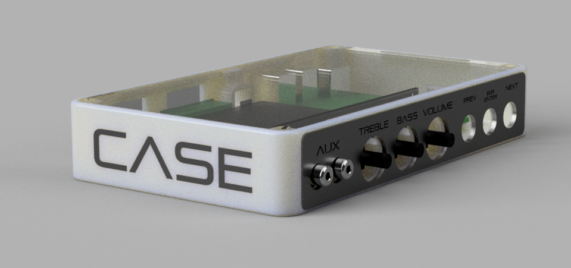

# Case Audio System



#
#### Usage
This repository contains resources and installation guides for the Case Audio System.

#### Software
* Volumio (*2.834*)
* Spotify Connect (pluggin)
* DSP [driver](https://github.com/MKSounds/ADAU1701-I2S-Audio-Driver-for-Raspberry-Pi)
#### Hardware
* Raspberry Pi 3B+
* ADAU1701 soundcard:
    * [new] [ADAU1701-2In4Out](https://www.3e-audio.com/dsp/adau1701-2in4out/) (balanced and with preamplifiers)
    * [old] [ADAU1701-KERNEL BOARD - APM2](https://store.sure-electronics.com/product/AA-AP23122) (unbalanced)
* Kramer active speakers:
    * [Tavor 5-O-White](https://www.dustin.se/product/5010851466/tavor-5-o---white)
    * [Tavor 6-O-White](https://www.dustin.se/product/5011137211/tavor-6-o)    
## Volumio for Raspberry Pi installation guide
This guide will  show the necessary steps to install and configure [Volumio](https://volumio.org/get-started/)
on a Raspberry Pi.
To get a working sound system you must also follow the DSP installation guide.

Note:
_A common reason for the Sound system to stop working seems to be a bricked SD-card. It is estimated that this
is due to excessive static discharge in the Lab. This may be fixed in the future with some input filtering on both audio and power 
input to the system. The only known way to fix this issue seems to be to redo this installation. However, make sure 
that the SD-card realy is bricked by connecting the device to a screen. If not bricked, the Raspberry Pi normally takes
 a couple of minutes to boot and will then show a terminal window._ 

1.
    The latest version of the Volumio image can be found at [volumio.org/get-started/](https://volumio.org/get-started/).
    
    To flash the image an _image burning tool_ is required. I recommend [Balena Etcher](https://www.balena.io/etcher/).

2.
    When the burning process is done, insert the SD-card into the Raspberry Pi and wait for it to boot. 
    The boot process is done when a wifi hotspot called *Volumio* appears. This is a temporary hotspot used to configure the new Volumio 
    installation. 
    
    Connect to the temporary wifi with the password ``volumio2``
3.
    The Volumio platform will always host a webpage. This page is used to interface with the device. 
    The address is by default ``volumio.local/``
    Go to this address and follow the installation wizard. 
    
    Note:    
    * When selecting name, use the same name as the room where the device is located e.g. one of:
        * Projectroom
        * Multiroom
        * Workshop
    * When prompted to select output device, select HDMI or Headphones. To configure the DSP, follow the DSP 
    installation guide when this guide is done.
    * When promoted to connect to a network, connect to **CASELAB**. After the installation is done, the Raspberry Pi will 
    connect to the network and the hotspot will be disabled. This will also result in the webaddress changing to the
    new name of the device! E.g: ``projectroom.local/``
    * At the end of the installation wizard it is asked for an account. This is not necessary. Reload the page and press **skip** if 
    the installation wizard starts again.
    
    * If Volumio does not automatically connect to the CASELAB wifi, go to 
    _settings->NETWORK_ and reconnect to the CASELAB wifi.

4. The Volumio installation is now done. You can try it out by playing music either throught the Headphone jack or
HDMI, depending on what you choose as output device. 
   
## DSP installation guide
This guide will show the steps required to install and configure the _Digital Sound Processor_ (DSP) which is used as
the soundcard for the CASE Audio System. The DSP chip used is the _ADAU1701_ from Analog Devices. The DSP chips is
mounted on a PCB from [3e-audio](https://www.3e-audio.com/dsp/adau1701-2in4out/), 
which also contains preamplifiers and filtering circuits. The system is mounted in a 3D printed 
enclosure.

This guide was tested to be working on version *2.834* of Volumio.

 
4. *SSH* is disabled by default in Volumio. We need access to SSH to configure the DSP. Thus, to enable SSH go to
    ``HOSTNAME.local/dev/``
    
    This is an admin page where you can enable and disabling SSH. Replace ```HOSTNAME``` with the given device name.
    
    Enable SSH.
    
5. SSH into the Raspberry Pi. The default name and password are both ``volumio``
6. The DSP driver installation steps are based on this 
    [guide](https://digital-audio-labs.jimdofree.com/english/raspberry-pi/adau1701-i2s-driver/) from the DSP driver creator [MKSounds](https://github.com/MKSounds).

    Clone the DSP drivers:
    ````shell script
    git clone https://github.com/MKSounds/ADAU1701-I2S-Audio-Driver-for-Raspberry-Pi
    ````
7. Copy drivers to overlays:
    ````shell script
    sudo cp ADAU1701-I2S-Audio-Driver-for-Raspberry-Pi/adau1701-i2s.dtbo /boot/overlays
    ````

8. Add the DSP to the dacs.json file:
    ````shell script
    sudo nano /volumio/app/plugins/system_controller/i2s_dacs/dacs.json
    ````
    
    By copy and pasting:
    
    ````shell script
    {"id":"adau1701-i2s","name":"ADAU1701 I2S Output","overlay":"adau1701-i2s","alsanum":"1","mixer":"","modules":"","script":"","needsreboot":"yes"},
    ````

    
    
    close the editor by ``ctrl + x`` then `y` and finally Enter.
    
9. Reboot the device
    ````shell script
    sudo reboot
    ````
10. The DSP driver is now installed and can be selected as output device.

    From the webpage, go to _Setings->PLAYBACH OPTIONS_ and enable **I2S DAC**

    In the **DAC Model** dropdown menu, select **ADAU1701 I2S Output**
    
    Press **Save**
    
    This will prompt you to reboot the device,
    
    Reboot the device.
    
    You are now done and the Sound system shall be operational. You can test this by playing from any
    radio station or installing the _Spotify Connect_-plugin.
    
    Note:
    * If by default the volume can not be changed, select *Software* in the *Mixer Type*-dropdown.
    * The current sound setup in the *Projectroom* is of an earlier type without preamplifiers and with unbalanced output.
    This means that, to auto start the speakers, a relatively high volume is required. This shall be fixed when the 
    system is replaced with the new version.
    
    

## AudioSupervisor installation guide
**The current version of AudioSupervisor is not working!**

*AudioSupervisor* is a Python script which controls the internal sound processor (DSP) based on external and scheduled 
events. The idea of this is to:
* Guard volume level at Working hours (Configurable)
* Guard volume level at Case Association hours (Configurable)
* Turn of sound system and disconnect from Spotify connect etc, at closing hours. This can be
 circumvented if the system is still in active use, or being enforced (Configurable)
* Interface panel mounted buttons to Volumio, e.g play/pause, previous- or next-song.

Install the supervisor by running the following command from the home path:
````shell script
    sudo apt-get update
    sudo apt-get install -y python-dev python-pip libfreetype6-dev libjpeg-dev build-essential python-rpi.gpio
    sudo pip install --upgrade setuptools pip wheel
    sudo pip install --upgrade socketIO-client-2
    sudo apt-get install rpi.gpio -y
    git clone https://github.com/caselabbet/case-AudioSystem
    chmod +x ~/CASE_DSP/AudioSupervisor.py
    sudo cp ~/CASE_DSP/AudioSupervisor.service /lib/systemd/system/
    sudo systemctl daemon-reload
    sudo systemctl enable AudioSupervisor.service
    sudo dpkg-reconfigure tzdata
    reboot
````


#
#### Created by: _Stefan Larsson_ CASE Board 2019